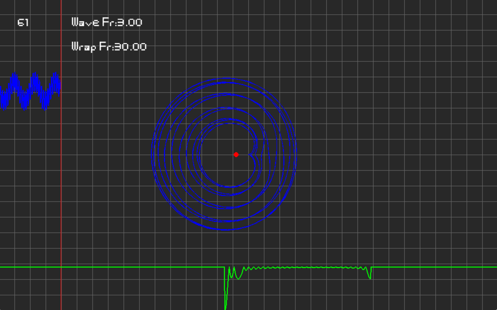

# Fourier Transform Visualization

## Features

- Helps to understand how the Fourier Transform actually works is in its essence  

###  this is just a small demo replica of [3Blue1Brown video](https://www.youtube.com/watch?v=spUNpyF58BY&ab_channel=3Blue1Brown) about the Fourier Transform(in the demo I am adding 2 frequencies: 3 and 30)

## A couple of screenShots:

